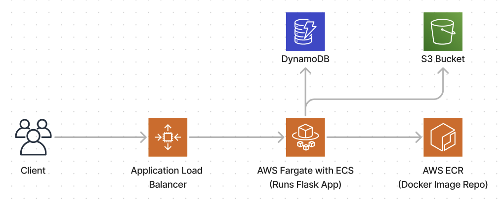
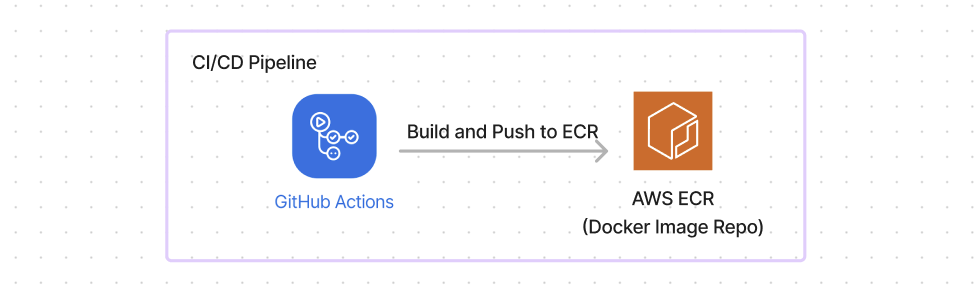

# Video Game Query API

This Flask-based API accepts user queries about video games and provides responses using OpenAI's GPT-4 model.

## Setup and Installation

1. Clone this repository

2. Create a virtual environment and activate it:
   ```sh
   python -m venv venv
   source venv/bin/activate
   ```

3. Install the required packages:
   ```sh
   pip install -r requirements.txt
   ```

4. Create a `.env` file in the root directory and add your OpenAI API key and CSV file path:
   ```
   OPENAI_API_KEY=your_openai_api_key_here
   CSV_FILE_PATH=data/games_description.csv
   ```

## Running the Application

### Option 1: Local Setup
To run the application, use the following command:

```sh
python run.py
```

The API will be accessible at `http://localhost:5000/query`.

### Option 2: Using Docker
Build the Docker image:
```sh
docker build -t flask-video-game-api .
```

Run the Docker container:
```sh
docker run -p 5000:5000 --env-file .env flask-video-game-api
```


## Using the API

Send a POST request to `http://localhost:5000/query` with a JSON payload containing a "query" field. For example:

```sh
curl -X POST -H "Content-Type: application/json" -d '{"query":"What is the player rating of Elden Ring?"}' http://localhost:5000/query
```

The API will return a JSON response with the answer to your query.

## Continuous Integration and Deployment
This repository uses a CI/CD pipeline configured with GitHub Actions.

### CI/CD Workflow:
1. Trigger: The pipeline is triggered on every push to the main branch.

2. Jobs:
   - Test: Runs unit tests located in the `tests/` directory.
   - Docker Build and Push:
     - Builds the Docker image for the application.
     - Runs the built image to ensure it's functional.
     - Pushes the image to Docker Hub with the latest tag after passing all tests.

> [!NOTE]
> The pipeline will automatically test, and build and push the image to Docker Hub on commits to the main branch.

## Cloud Deployment

- Containerization: We’ll push the Docker image to Amazon ECR (Elastic Container Registry). This acts as the repository to store our Docker images.
- Compute Service: For running the containerized app, we’ll use AWS Elastic Container Service (ECS) with Fargate. ECS is a fully managed container orchestration service, and Fargate provides serverless compute so we don't need to manage the underlying infrastructure.

- Networking:
  - VPC (Virtual Private Cloud): Create a VPC with subnets, route tables, and a security group to define networking and security for the ECS service.
  - Application Load Balancer (ALB): Use an ALB to distribute incoming traffic across multiple containers (if we scale out) and route the traffic to the ECS service. The ALB will also handle HTTPS termination (SSL/TLS) and route requests to ECS.

- Storage:
  - S3 (Amazon Simple Storage Service): For any static files, logs, or backups, use S3 to store them securely and access them when needed.
  - Database: If the app requires a database, deploy Amazon RDS for a managed relational database service or DynamoDB for NoSQL if needed.

### CI/CD Pipeline for Continuous Deployment:

1. Once code is pushed to the main branch, the CI/CD pipeline triggers.
2. Build and Test: The pipeline first runs unit tests, followed by Docker image building.
3. Push to ECR: After passing tests, the image is pushed to Amazon ECR.
4. Deploy to ECS: The pipeline updates the ECS service (through an AWS CLI command or ECS GitHub Action), which will pull the new image from ECR and deploy the new version of the application.